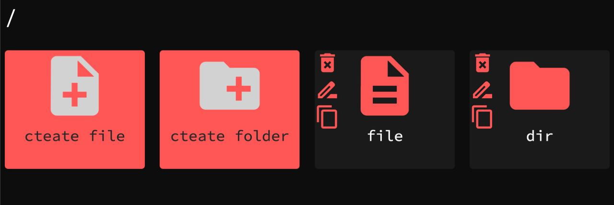
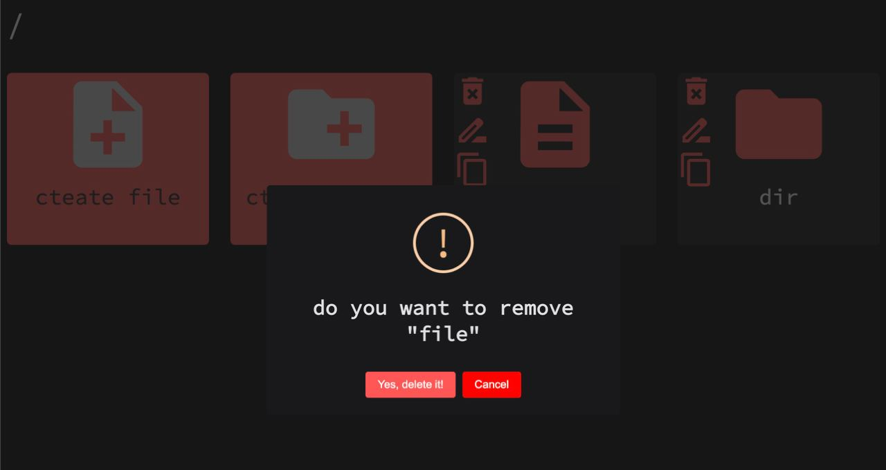
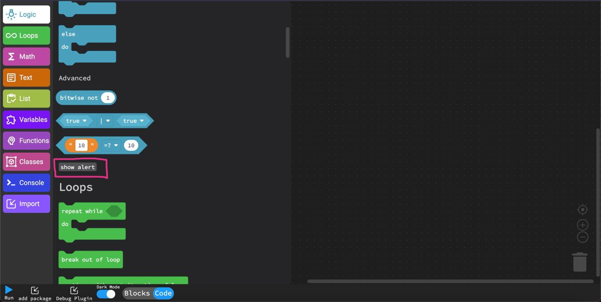

  

# Plugin development

  

Note: put a //ver=`<anything>` in someplace in the code of your plugin that would help the editor to show an "Update" button if it is necessary

  

### Editor.addOnCodeExecutedEvent(callback)

```javascript

Editor.addOnCodeExecutedEvent(function() {

console.log('code executed')

})

```

this function registers a callback to run when code executed

### Editor.isPluginInstalled(pluginName)

```javascript

Editor.isPluginInstalled('radinParsaei/Blockly-test-plugin-development')

> true

```

returns true or false, true if plugin with that pluginName is installed

### Editor.isDark()

```javascript

Editor.isDark()

> true

```

returns true if the current theme is dark

### Editor.requirePlugin(pluginName, callback)

this function ensures a plugin is installed

### Editor.setBlocksEditorGrid(grid)

```javascript

Editor.setBlocksEditorGrid({

spacing :  35,

length :  9,

color :  'gray',

snap :  true

})

```

or:

```javascript

Editor.setBlocksEditorGrid(undefined)

```

This can be used to remove grid

### Editor.setEditorColor(color)

```javascript

Editor.setEditorColor('#f55')

```

will result something like:



### Editor.setTheme(theme(`'dark'` or `'light'`)

```javascript

Editor.setTheme('dark')

```

Darkens the editor

### Editor.changeTheme()

Switches between light and dark editor themes

### Editor.setEditorCancelColor(color)

```javascript

Editor.setEditorCancelColor('red')

```



### Editor.addButton(category, 'text', callback)

```javascript

Editor.addButton('Logic', 'show alert', function() {alert("Hello")})

```



### `Editor.getAceEditor()`, `Editor.getBlockly()`, `Editor.getSwal()`

Access Blocky, Ace Editor, and Swal (sweet alert) objects directly

It's much better to use these functions because if someday some of these libraries changed, your plugin just won't execute instead of making mess in editor or making big errors

### Editor.getCode()

get content of text editor

### Editor.isRTL, Editor.setBlocksEditorRTL

check if editor is RTL or not and setBlocksEditorRTL to set editor direction

### Editor.registerSnippet

```javascript

Editor.registerSnippet([{'name':  'snippetName', 'code':  '// code here'}])

```

### Editor.setFont('arial')

set editor font

### Editor.setFonts('arial')

set all of the fonts

### Editor.setToolBoxFont('arial')

set toolbox font

### Editor.setBlocksFont('arial')

set blocks font

### Editor.setTextEditorColorDark(type, color), Editor.setTextEditorColorLight(type, color), Editor.setTextEditorColor(type, color)

set color of text highlighting in light, dark, or both themes

```javascript

Editor.setTextEditorColorDark('keyword', '#f55')

// change keywords color(for example: var if else)

Editor.setTextEditorColorDark('gutter-background', '#333')

// change gutter background color

Editor.setTextEditorColorDark('gutter-color', 'green')

// change gutter line numbers color

Editor.setTextEditorColorDark('background', 'black')

// change editor background color

Editor.setTextEditorColorDark('active-gutter-color', 'cyan')

// change active gutter line numbers color

Editor.setTextEditorColorDark('active-gutter-background', 'gray')

// change background color of active gutter

Editor.setTextEditorColorDark('number', '#1feab0')

// change color of numbers in the editor

Editor.setTextEditorColorDark('bool', '#1fb0ea')

// change color of booleans in the editor(true and false)

Editor.setTextEditorColorDark('predefined', 'pink')

// change color of predefined names(for example: print, append)

Editor.setTextEditorColorDark('string', 'orange')

// change color of string literals

Editor.setTextEditorColorDark('activehint', 'green')

// change color of active hint (in autocomplete suggestions)

Editor.setTextEditorColorDark('hinthover', '#44ff7755')

// change hint hover color

```

### Editor.setCategoryColor(category, color)

change color of category

```javascript

Editor.setCategoryColor('Console', 'red')

```
### Editor.addBlock(yaml)
```javascript
let yml = `
---
  Test: #name of the category
    color: ff0000 #color of the category
    icon: text.svg #icon of the category
    blocks:
      - test: #there is a block that we call it test
          shadows:
            - 1 #it has one shadow(Whenever no other value is present in the input, this value fills it)
          args:
            a: value
            b: statement #we have two inputs one of them gives a normal value and the other one gives a program, a statement(as a lambda function)
          function: test #the function that we call when this block is used. you can see definition of it in the next line
          code: >
            func test(a, b) {
              print(a)
              b!()
            }
          messages: #The messages we want to appear on the block (we put them before inputs)
            - test
            -
          hasReturn: false #is it a block that returns something (ellipse ones)
          tooltip: test #the tooltip of the block
`
createBlocksFromYAML(yml)
```
## Utils
### Editor.utils.isOverflown(element)
this function is used to check if the bottom dock is overflown. Plugins can also check if an element is overflown with this feature